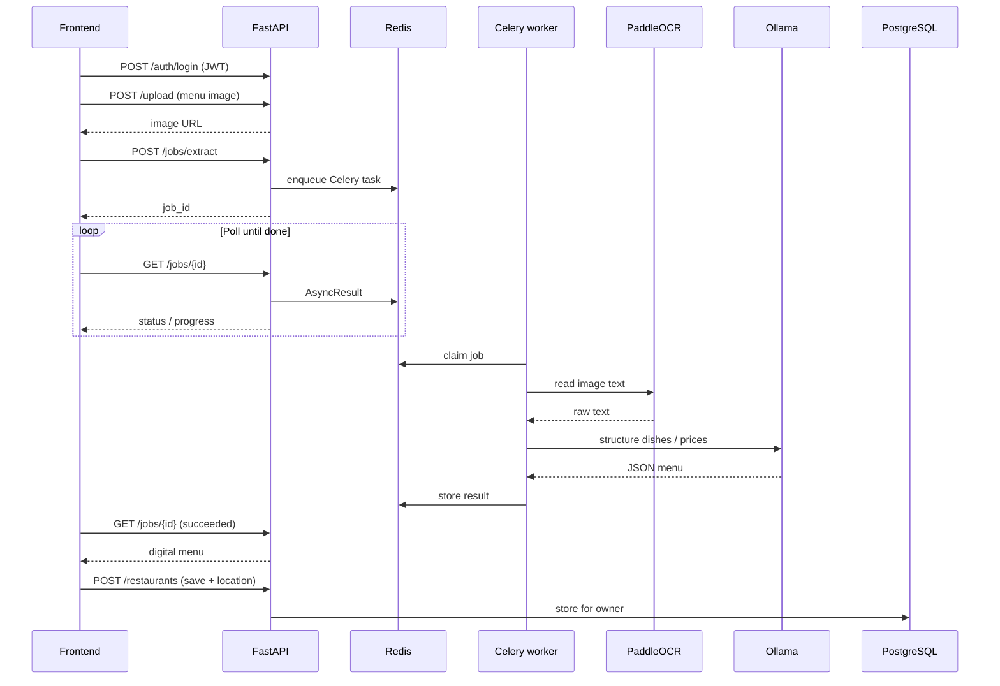

# Vision AI Extractor — Backend

FastAPI API that powers [Vision AI Extractor](https://github.com/vidaHd/vision-ai-frontend): upload a menu photo, run OCR, structure dishes with an LLM, and persist restaurants per user.

<p align="center">
  <a href="https://github.com/vidaHd/vision-ai-frontend">Frontend</a> ·
  <a href="#what-happens">How it works</a> ·
  <a href="#api">API</a> ·
  <a href="#quick-start">Quick start</a>
</p>

---

## What happens



1. **Auth** — register / login, JWT on protected routes.  
2. **Upload** — store the menu image under `/uploads`.  
3. **Jobs** — `POST /jobs/extract` queues OCR + LLM on Celery/Redis; poll `GET /jobs/{id}`.  
4. **Worker** — PaddleOCR then Ollama (OpenAI-compatible `/v1`).  
5. **Restaurants** — owner-scoped CRUD with optional map coordinates.  
Sync `POST /ocr` and `POST /menu/extract` still exist for debugging.

---

## Stack

| Piece | Role |
|-------|------|
| FastAPI | HTTP API |
| Celery + Redis | Async OCR/LLM jobs |
| SQLAlchemy + Alembic | ORM & migrations |
| PostgreSQL 16 | Persistence |
| PaddleOCR | Text from images |
| Ollama | Local LLM (`qwen2.5:3b` by default) |
| JWT (HS256) | Auth |

---

## API

Interactive docs when the server is up: **http://localhost:8000/docs**

| Area | Endpoints (summary) |
|------|---------------------|
| Health | `GET /health` |
| Auth | `POST /auth/register`, `POST /auth/login`, `GET /auth/me` |
| Upload | `POST /upload` |
| Jobs | `POST /jobs/extract`, `GET /jobs/{id}` |
| OCR | `POST /ocr` (sync, debug) |
| Menu | `POST /menu/extract` (sync, debug) |
| Restaurants | `GET/POST /restaurants`, `GET/PATCH/DELETE /restaurants/{id}` |
| Files | Static `/uploads/...` |

---

## Quick start

### Docker (with frontend + DB + Ollama)

From the parent workspace (`docker-compose.yml`):

```bash
cp .env.example .env
docker compose up --build
```

API: **http://localhost:8000** · Docs: **http://localhost:8000/docs**

```bash
docker compose exec ollama ollama pull qwen2.5:3b
```

### Local Python

```bash
python -m venv .venv
source .venv/bin/activate
pip install -r requirements.txt
cp .env.example .env   # or set DATABASE_URL, SECRET_KEY, LLM_*
alembic upgrade head
uvicorn app.main:app --reload --port 8000
```

### Environment

| Variable | Purpose |
|----------|---------|
| `DATABASE_URL` | SQLAlchemy URL |
| `REDIS_URL` / `CELERY_*` | Celery broker + result backend |
| `SECRET_KEY` | JWT signing key |
| `LLM_BASE_URL` | Default `http://ollama:11434/v1` in Compose |
| `LLM_MODEL` | e.g. `qwen2.5:3b` |
| `LLM_API_KEY` | Non-empty placeholder for Ollama |

Never commit a real `.env`.

### Docker image

```bash
docker build -t vidahedayati/vision-ai-backend .
```

Worker (same image):

```bash
celery -A app.workers.celery_app.celery_app worker --loglevel=info --concurrency=1
```

---

## Project structure

```
backend/
├── alembic/           # Migrations
├── app/
│   ├── api/routes/    # auth, upload, jobs, ocr, menu, restaurants
│   ├── core/          # config, security
│   ├── db/
│   ├── models/
│   ├── schemas/
│   ├── services/      # OCR, LLM, restaurants, users
│   └── workers/       # Celery app + extract task
├── Dockerfile
└── requirements.txt
```

---

## Related

| Part | Repository |
|------|------------|
| Backend (this repo) | https://github.com/vidaHd/vision-ai-backend |
| Frontend UI | https://github.com/vidaHd/vision-ai-frontend |

---

## License

Personal / portfolio project by [vidaHd](https://github.com/vidaHd).
